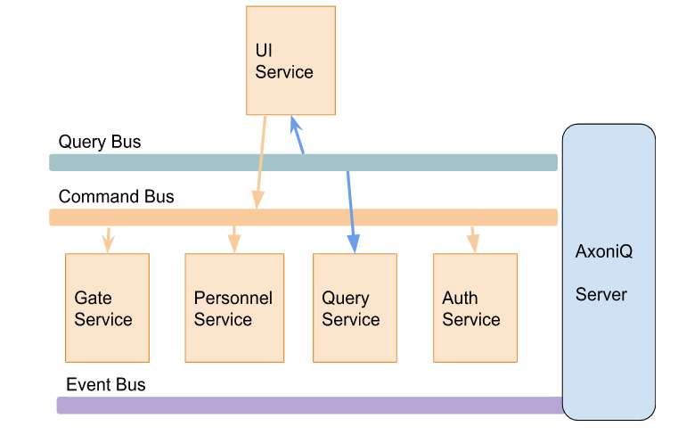
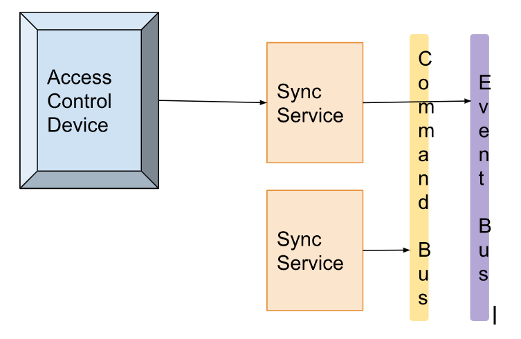
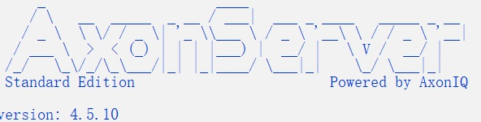
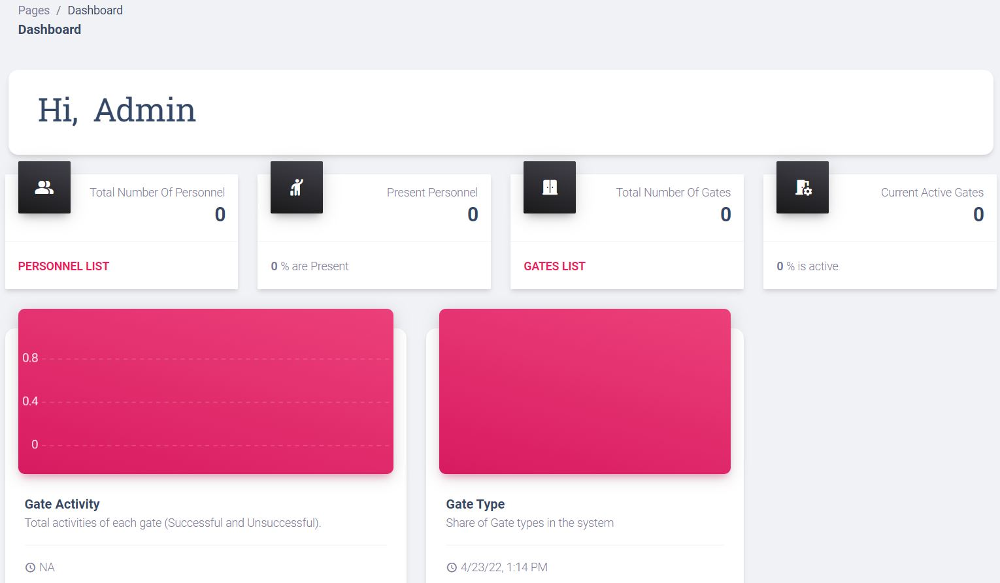
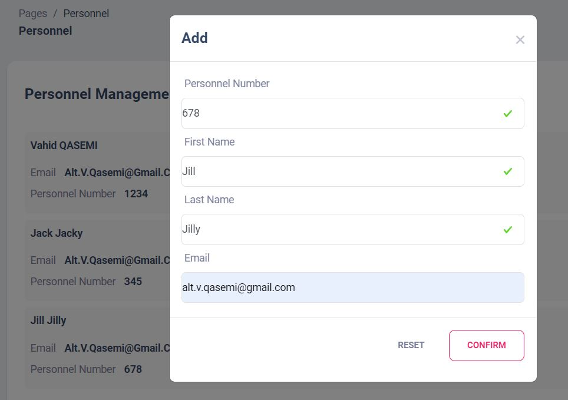
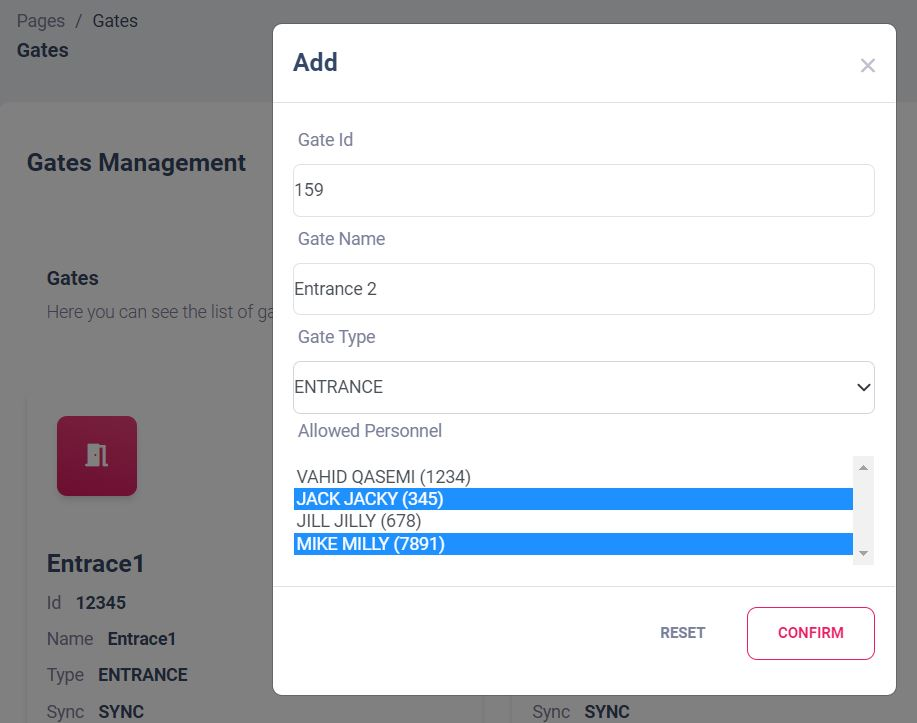
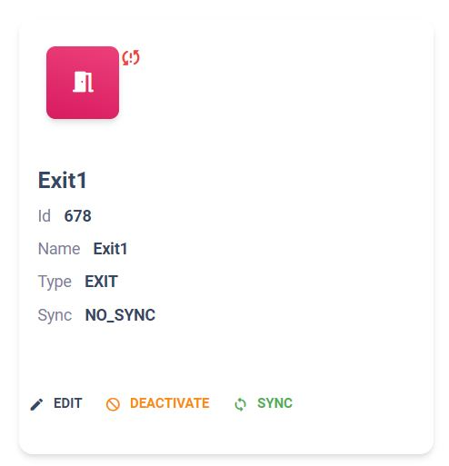
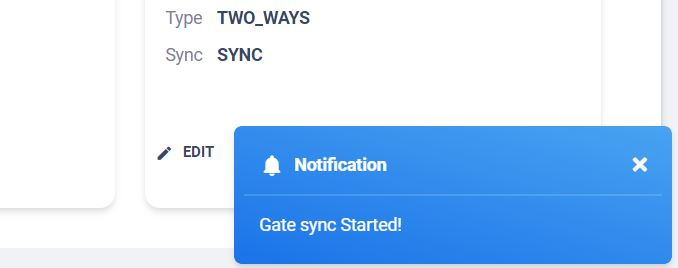

# Simple Acs using Axon

The story begins in Spring of 2019 when I was working at a company that provided access control systems. After the new
years holiday, an incident was reported that some traffic logs were missing. During that time of the year, the clocks
were adjusted for one hour (Daylight saving time) and the IT department was responsible for synchronizing the clock time
of the access control devices with the server (supposedly they did not) and blamed it on some bug on the software. Later
on, we addressed this issue through scheduled automatic synchronization and did some modifications to our log configs.
However, what happened at that time remained a mystery.

I did some research and found that software that we develop have intrinsic limitation, since we can only have a snapshot
of current state of the system that we store in the form of DB entries, log files etc. Then I studied the concept of
Event Sourcing and thought it could provide great possibilities by enabling us to model our systems based on events that
are happening and every time we need, we can reply the events and handel them differently or build new views of the
system.

These concepts sounded promising; however building such system from the scratch is challenging task. Then I found out
about [Axon Framework](https://github.com/AxonFramework/AxonFramework#:~:text=Axon%20Framework%20is%20a%20framework,blocks%20to%20follow%20these%20principles.)
. A framework which provides **event sourcing/streaming** based on **CQRS** principles.

# Acs

This simple Access control system is based divided into 4 main submodules:

- **acs-personnel**: Manages personnel details
- **acs-gate**:  Manages gates that personnel pass through them.
- **acs-authentication**: Performs the actual authentication by checking the existence of personnel and their access to
  a specific gate.
- **acs-query-service**: It is a materialized view of the current state of the system (Personnel, Gates, Traffic logs).
- **acs-ui**: It is a Spring MVC/Thymeleaf based application that provides a web GUI for the application.

### Using Axon Framework

As you can see, different modules of the system utilize three communications buses:

- **Command**: Is responsible for delivering command messages to registered command handlers.
- **Query**: Is responsible for delivering query messages to registered query handlers.
- **Event**: Execution of commands results in generating events and these events are delivered to all the listening
  event handlers. Also, all the generated events are stored in the Axon.

Axon framework promotes domain-driven-design and each command handler can handle commands that are targeted to a
specific domain aggregate, specified by their domain aggregate id. So we define a domain aggregate for personnel. in
this domain we handle commands about creating or modifying personnel (deleting an aggregate can have different meaning
in different scenarios so, I skipped it for now.) and checking if the personnel is present.

> **Note:** Each time a command is delivered to an aggregate The state of the aggregate is rebuilt based on previous evens.
> We can improve this behaviour by adding cache and preventing the rebuild of aggregate.

## Personnel Aggregate (acs-personnel module)

Axon framework promotes domain-driven-design and each command handler can handle commands that are targeted to a
specific **domain aggregate**, specified by their domain **aggregate id**. So we define a domain aggregate for
personnel. in this domain we handle commands about creating or modifying personnel (deleting an aggregate can have
different meaning in different scenarios, so I skipped it for now.) and checking if the personnel is present.

Also, domain aggregates can **register for specific events** and **update their state**  .

> **Note:** Each time a command is delivered to an aggregate The state of the aggregate is rebuilt based on previous evens. We can improve this behaviour by adding cache and preventing the rebuild of aggregate.

## Gate Aggregate (acs-personnel module)

In this module we define Gate aggregate root and all the related services. One important service is Synchronisation of
data which is stored in the application with the physical Access control device. so in-case the access control device
looses connection with the server then it can at least perform some basic authentication checking
(NOTE: I did not implement the actual FTP communication). However, the Synchronisation service notifies the Gate
aggregate via internal events about the synchronisation status.

## Authentication Service (acs-authentication module)

It is a simple Rest API with just one end point called **check** which can be called via the physical access control
device to authenticate the personnel. The **authentication flow** is very simple and involves querying the Gate and
Personnel Domains.

> **Note:** For more sophisticated authentication flow scenarios we can utilize **Saga pattern support in Axon**.

## Query Projection (acs-query module)

This module provides a view of the state of the system which can be used for query operations. The UI module relies on
this module for data representations.

## UI (acs-ui module)

This is a simple Spring MVC application with Thymeleaf as templating engine. Also, to improve the UX, Bootstrap, Ajax
and some third party static HTML content was used.

##  Common (acs-common module)
This module contains  Events, Commands, Queries and common models and value objects which are 
used across the project.

## Reports (acs-reports module)
Generates some historical reports about the overall activity of the gates from the beginning until the now. 
Running this service is optional, and it does not affect behaviour of the application (except some error logs in the UI module).

The moment we start this service, all the relevant events will be replayed, and we can get total activities of each gate in the UI.

# How to Build

## Using Maven

To build the project, navigate to the project's root directory and run:

    mvn clean package

The final output should be:

    [INFO]
    [INFO] acs-axon-starter ................................... SUCCESS [  0.359 s]
    [INFO] acs-axon-common .................................... SUCCESS [ 23.503 s]
    [INFO] acs-personnel ...................................... SUCCESS [ 15.647 s]
    [INFO] acs-gate ........................................... SUCCESS [  9.901 s]
    [INFO] acs-auth ........................................... SUCCESS [  6.456 s]
    [INFO] acs-query .......................................... SUCCESS [  8.537 s]
    [INFO] acs-reports ........................................ SUCCESS [  2.190 s]
    [INFO] acs-ui ............................................. SUCCESS [ 11.446 s]
    [INFO] ------------------------------------------------------------------------
    [INFO] BUILD SUCCESS
    [INFO] ------------------------------------------------------------------------

## Using IDE

Also, you  intellij and you can load the project in the IDE and run it directly from there.

# How to RUN

After building the project we have two approahes to run it:
1. Run on Docker
2. Run On Local Filesystem

## Run on Docker

Simply execute the docker-compose file.

    docker-compose up

It will spin up all the services 

You should see the following entry in the axon server logs: 

    Axon Server Gateway started on port: 8124

## Run On Local Filesystem

This approach involves two steps:

1. Run Axon Server
2. Run the Application

### Run Axon Server

Before running the application you should run the Axon server. Extract the AxonServer-4.5.10.zip and 
navigate to the 'AxonServer-4.5.10' directory and run the Axon server.

    java -jar axonserver.jar

You should see an output like this:

### Run the Application

Navigate to each individual module and start them dependently in any order. A docker compose file will be added later but for now you can run the services in the following suggested order.

    java -jar .\acs-ui\target\acs-ui-1.0.0.jar
    java -jar .\acs-query\target\acs-query-1.0.0.jar
    java -jar .\acs-gate\target\acs-gate-1.0.0.jar
    java -jar .\acs-personnel\target\acs-personnel-1.0.0.jar
    java -jar .\acs-auth\target\acs-auth-1.0.0.jar
    java -jar .\acs-reports\target\acs-auth-1.0.0.jar

# How to Use

After running all the services, navigate to,
and you can use one of the following credentials to login:

> ☝ 
> 
> Username: admin, Pass: pass
> 
> Username: user, Pass:pass

Since the **admin has more privileged access,** use the admin to log in.

In the Dashboard page you can see an overview of the system.

## Adding Data

> ☝
> **NOTE**: Due to setting up process of Command handlers, initial data entry might be slow but the remaining entries will be quick 

Navigate to the [Personnel List page](http://localhost:8081/manager/personnel) and add new personnel.

Then go to Gates Lists and add new gates. In the add new gates you can assign personnel to gates, then only the assigned 
personnel are authorized to pass those gates.

In a hypothetical scenario when we modify a gate, its date becomes out of sync with the physical gate and a no syc icon 
will appear.

Then we can send a syc command, and the gate will be syc and will well be notified when the operation is complete. 

To perform authentication check, send Http request with the following format to the **access/check** endpoint.

> 127.0.0.1:8083/access/check?gateId=[GATE_ID]&personnelId={PERSONNEL_ID}&action=[ACTION possible values are {EXIT, ENTER}]

For example the following will check access for **Entering** gate ID **456** for person with id **222**

    127.0.0.1:8083/access/check?gateId=456&personnelId=222&action=EXIT

 

